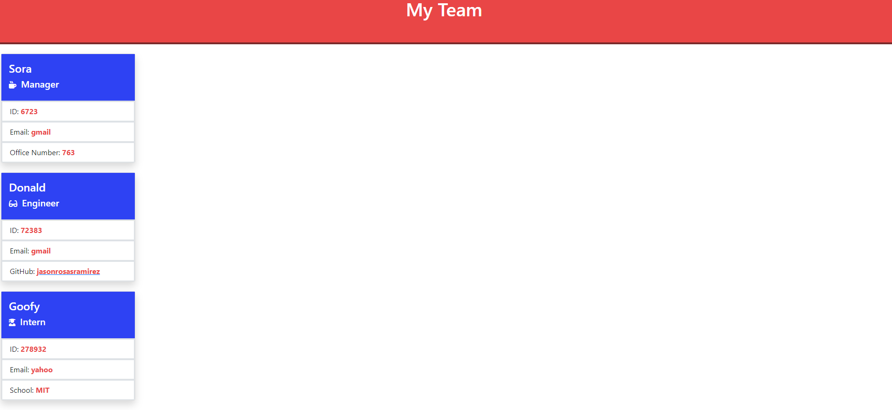

# 10 Object-Oriented Programming: Team Profile Generator

## Your Task

Your task is to build a Node.js command-line application that prompts information on team members and builds a dashboard to view team imformation quickly. The information can be used to quickly display active members to management. 

## Mock-Up

The following image shows a mock-up of the generated HTML’s appearance and functionality:

## Review

You are required to submit the following for review:

* A walkthrough video that demonstrates the functionality of the application and passing tests. https://drive.google.com/file/d/1Lpw4u7YTtUCxXtCI4FtEMiAHk0gBF7hL/view

* A sample HTML file generated using your application. https://drive.google.com/file/d/12IBYR_a1OLB_gVMC3tKce1cmR82l8MCV/view?usp=sharing

* The URL of the GitHub repository, with a unique name and a readme describing the project. https://github.com/Jasonrosasramirez/TeamVisualizer

---
© 2021 Trilogy Education Services, LLC, a 2U, Inc. brand. Confidential and Proprietary. All Rights Reserved.

## Screenshot

